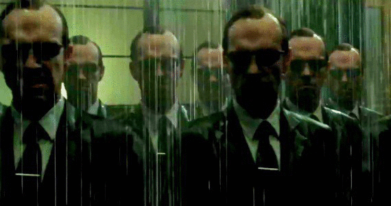

# Agent Smith of the Deep Learning World




## Building an agent for deep learning objects:

* dataloader 
* train / validation step
* loss visualization 
* regularization 


## Reading Order 

* torchEngine_tutorial.ipynb ; ```basic```
* torchEngine_wandb_tutorial.ipynb ; ```wandb```
* torchEngine_multiclass_metric_tutorial.ipynb ; ```multiclass metric```
* torchEngine_FindingLR_tutorial.ipynb ; ```LR Range Test``` to find an appropriate range for the initial learning rate & ```LR scheduler``` 
* torchEngine_SchedulerUsage_tutorial.ipynb ; ```LR scheduler```  usage
* torchEngine_gradient_clipping_tutorial.ipynb; ```handling the exploding gradients ```
* torchEngine_hooks_tutorial.ipynb ; ```visualization``` {filters, feature maps, hooks}


***

### TO DO LISTS 

- [x] add [wandb visualization](https://wandb.ai/site) , ([3rd_src](https://github.com/wandb/examples))

- [x] add multi-class classification metric 

- [x] add learning rate scheduler 

- [x] add gradient clipping (for Exploding Gradients)

- [x] add hooks

- [ ] add early stopping 

- [ ] add [hydra](https://hydra.cc/) for hyperparameter sweeps

  

